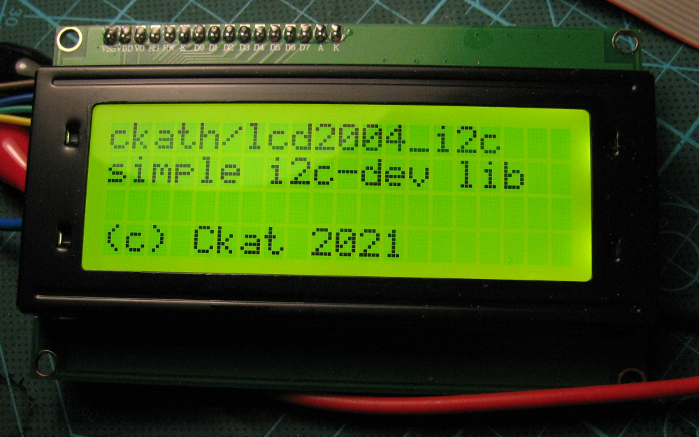

---
a simple lib for interfacing with lcd2004 screens using linux i2c devices(/dev/i2c-*n*), no fancy libraries needed besides i2c-dev. I couldn't find any library that did this without including a bunch of pi specific nonsense, so this is that.

## features
- works fine on any linux system with an i2c bus, even if its vga
- simple move cursor, write to display functions
- ability to turn backlight on/off (for some reason most libs lack this) 
- ability to define custom characters in cgram
- full commandset(from what I could find) defined
- single header include, .gitignore, easy use as submodule

## functions
- `LCD *lcd_init(int bus, int addr)`\
initialize display on bus(/dev/i2c-*bus*) with address(use `i2cdetect -y bus`), returns `NULL` on failure
- `lcd_delete(LCD *lcd)`\
close connection and free resources of display, doesnt turn it off
- `lcd_move(LCD *lcd, int x, int y)`\
move cursor to x y position
- `lcd_write(LCD *lcd, char *data)`\
write data to display at current cursor position
- `lcd_mvwrite(LCD *lcd, int x, int y, char *data)`\
move+write in one
- `lcd_backlight(LCD *lcd, uint8_t on)`\
turn backlight on/off
- `lcd_clear(LCD *lcd)`\
clear lcd, also homes cursor position
- `lcd_off(LCD *lcd)`\
turn display off
- `lcd_on(LCD *lcd)`\
turn display on
- `lcd_send_cmd(LCD *l, uint8_t cmd)`\
send command to display, see header for available ones, format is `GENERALCOMMAND | FLAGS`
- `lcd_send_chr(LCD *l, uint8_t chr)`\
send single char to display, will be printed at current cursor position
- `lcd_cgramset(LCD *lcd, uint8_t addr)`\
sets address for adding user defined character, range 0x0 to 0xf, see example as well

## example usage
### getting started
make sure i2c-tools are installed and the i2c-dev modules is loaded(`modprobe i2c-dev`).

find the i2c devices that you have it connected to with `i2cdetect -l`, after you know which bus its on use `i2cdetect -y bus`, it'll produce something like this showing the address, probably `0x27` like here:
```
     0  1  2  3  4  5  6  7  8  9  a  b  c  d  e  f
00:          -- -- -- -- -- -- -- -- -- -- -- -- --
10: -- -- -- -- -- -- -- -- -- -- -- -- -- -- -- --
20: -- -- -- -- -- -- -- 27 -- -- -- -- -- -- -- --
30: -- -- -- -- -- -- -- -- -- -- -- -- -- -- -- --
40: -- -- -- -- -- -- -- -- -- -- -- -- -- -- -- --
50: -- -- -- -- -- -- -- -- -- -- -- -- -- -- -- --
60: -- -- -- -- -- -- -- -- -- -- -- -- -- -- -- --
70: -- -- -- -- -- -- -- --
```

knowing the bus and address, for example `12` and `0x27`:
```
#include <stdio.h>
#include "lcd2004_i2c.h"

int
main(int argc, char *argv[])
{
	LCD *lcd = lcd_init(12, 0x27);
	if (!lcd) {
		fputs("failed to open lcd", stderr);
		return 1;
	}

	lcd_mvwrite(lcd, 0, 0, "ckath/lcd2004_i2c");
	lcd_mvwrite(lcd, 0, 1, "simple i2c-dev lib");
	lcd_mvwrite(lcd, 0, 3, "(c) Ckat 2021");
	return 0;
}
```

### defining and using custom characters
another thing not mentioned often is how to define the 16(0x0-0xf) characters in cgram on these lcds. this is achieved by first sending `LCD_SETCGRAMADDR | ADDR`, then sending the 7 5 bit lines to define the character, and one for the cursor line. this library comes with a macro to ease this process, making it as easy as follows:
```
#define ARROW_UP 0x0
#define ARROW_DOWN 0x1

lcd_cgramset(lcd, ARROW_UP);
lcd_send_chr(lcd, 0b00000100);
lcd_send_chr(lcd, 0b00001110);
lcd_send_chr(lcd, 0b00011111);
lcd_send_chr(lcd, 0b00000100);
lcd_send_chr(lcd, 0b00000100);
lcd_send_chr(lcd, 0b00000100);
lcd_send_chr(lcd, 0b00000100);
lcd_send_chr(lcd, 0); /* cursor line, blank */

lcd_cgramset(lcd, ARROW_DOWN);
lcd_send_chr(lcd, 0b00000100);
lcd_send_chr(lcd, 0b00000100);
lcd_send_chr(lcd, 0b00000100);
lcd_send_chr(lcd, 0b00000100);
lcd_send_chr(lcd, 0b00011111);
lcd_send_chr(lcd, 0b00001110);
lcd_send_chr(lcd, 0b00000100);
lcd_send_chr(lcd, 0); /* cursor line, blank */

/* important: return to regular DDRAM mode afterwords */
lcd_send_cmd(lcd, LCD_SETDDRAMADDR);
lcd_send_chr(lcd, ARROW_UP);
lcd_send_chr(lcd, ARROW_DOWN);
```
